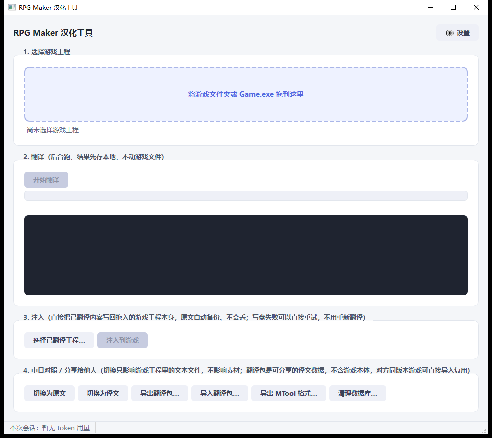
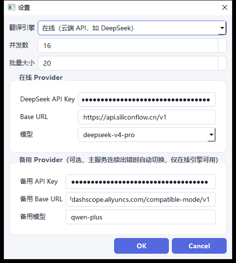

<div align="center">

# RPG Translator

[](LICENSE)


[](../../releases)

🌐 English · [简体中文](README.zh-CN.md) · [日本語](README.ja.md)

[🚀 Quick Start](#quick-start) · [📥 Releases](../../releases) · [⚙️ Configuration](#configure-engine) · [🐛 Issues](../../issues)

**RPG Maker / WOLF RPG Editor game text extraction → AI translation → inject-back tool.**

Drag the game folder into the window: extract text, run it through an LLM, and write the
translation back into the game project in place — with one click. The original version is
automatically backed up before injection, so you can toggle "Show Original / Show Translation"
for a side-by-side comparison anytime, without keeping a separate localized copy of the folder.

The experience is similar to MTool, but with finer-grained translation memory: identical source
text reuses the same translation by default, while the QA pass separately flags cases where the
same line might need a different translation depending on context, instead of blindly replacing
every occurrence globally.



</div>

<br>

<details>
<summary><b>📋 Table of Contents</b></summary>
<br>

- [✨ Core Features](#core-features)
- [🎮 Supported Engines](#supported-engines)
- [🚀 Quick Start](#quick-start)
- [⚙️ Configure Translation Engine: Online API / Local Model](#configure-engine)
- [🧑‍💻 Developer Guide: CLI / Testing / Packaging](#dev-guide)
- [⚠️ Known Limitations](#known-limitations)
- [🛠 Tech Stack](#tech-stack)
- [📄 License](#license)

</details>

---

<a id="core-features"></a>
## ✨ Core Features

### Translation quality & consistency
- 🔒 **Control code protection**: variable/color codes such as `\C[n]` `\N[n]` `\V[n]` are escaped
  into placeholders before translation and restored with an integrity check afterward. The
  `\n<CharacterName>text` speaker-tag convention (used by some projects) splits the character
  name and body text apart, translates them separately, and reassembles them — the model never
  sees the angle brackets, which eliminates "should this markup be kept" mistakes at the source.
- ♻️ **Translation-memory dedup**: identical source text only calls the API once, balancing
  efficiency and consistency.
- 🔍 **QA consistency scan**: cases where the same source text might need different translations
  in different contexts are exported separately into a review list, instead of being silently
  replaced everywhere.

### Stability & efficiency
- ⏯️ **Resumable**: if you manually stop mid-run or the process gets killed, reopening the app
  continues where it left off — already-translated content is never re-translated.
- 🔁 **Automatic retry on failure**: a single failed translation doesn't hold up the whole batch;
  failed entries stay marked as pending. After a translation pass finishes, it automatically
  retries in place for 2 more rounds (5s apart); anything still failing can be rerun directly with
  the "Retry Failed" button (no need to re-run extraction).
- 🔀 **Multi-provider failover**: if the primary provider errors repeatedly (rate limits / 5xx),
  it automatically switches to a backup provider, retrying with exponential backoff.
- 🧯 **Adaptive rate-limit backoff**: when hitting a 429, all concurrent requests to the same
  provider share one cooldown window (honoring `Retry-After` when present, otherwise backing off
  exponentially based on consecutive hits), preventing independent retries from repeatedly
  colliding on the same rate-limit window.
- ⚡ **Concurrency limiting + batched requests**: saves both time and tokens (pairs well with
  DeepSeek's prompt caching); batch size is adjustable in the settings panel.

### Workflow
- 🔄 **One-click original/translation toggle**: if a translation looks off, switch back to the
  original to check without re-running injection.
- 📦 **Translation package sharing**: export a lightweight `.rpgtrans.json` that others with the
  same game version can import directly and reuse, without spending their own API budget;
  exporting to MTool format (`ManualTransFile.json`) is also supported.
- 📂 **Single-file exe auto-unpacking**: if the dropped game is a single-file exe packed by Enigma
  Virtual Box (no loose `www/data` folder to be found), it's automatically unpacked and then
  re-detected — no need to manually find an unpacking tool first.

---

<a id="supported-engines"></a>
## 🎮 Supported Engines

| Engine | Status | Notes |
|---|:---:|---|
| RPG Maker MV / MZ | ✅ | Plain JSON; the event-command encoding table has been calibrated against real projects. |
| RPG Maker VX Ace | ✅ | Ruby Marshal binary format, including a pixel-accurate dynamic line-wrap runtime patch for the message box (spec 9.2.b, see [Known Limitations](#known-limitations) below); database/event text extraction has been verified against real projects. |
| RPG Maker XP | ✅ | Verified against a real XP project (the GPL-3.0 fan game torresflo/Pokemon-Obsidian on GitHub), which surfaced and led to fixes for two bugs only reproducible on real projects (see [Known Limitations](#known-limitations) below). |
| RPG Maker VX | ✅ | Shares the same adapter code as XP; verified against a real VX project (the open-source fan game ambratolm-games/flower-in-pain on GitHub), which surfaced and led to a fix for an object-reference bug in the Ruby Marshal writer library (see [Known Limitations](#known-limitations) below). |
| WOLF RPG Editor (Wodita) | ✅ | Verified against WOLF RPG Editor's own official sample project (full coverage of Map/CommonEvent/Database files, including the LZ4 compression format used by default in the current editor version). WolfPro-encrypted and classic-XOR-encrypted projects are still not supported. |
| RPG Maker 2000/2003 | ❌ | Completely different format, explicitly out of scope. |

> **Dropped in a single-file exe with no loose project files?** Many RPG Maker MV/MZ games use
> [Enigma Virtual Box](https://enigmaprotector.com/en/aboutvb.html) to bundle the `www` resource
> folder and the nw.js runtime into a single exe for distribution (no `www/data` on disk — just
> one lone exe, anywhere from a few hundred MB to a few GB). When you drop this kind of folder in
> and normal detection fails but a packed exe like this is found at the top level, it's
> automatically unpacked into a sibling `<original-folder-name>_unpacked` directory (may take a
> while for large files), and the engine is automatically re-detected afterward — this works the
> same regardless of whether the engine turns out to be MV/MZ or VX Ace/XP/VX/WOLF; the unpacking
> step itself is engine-agnostic.

---

<a id="quick-start"></a>
## 🚀 Quick Start

Prebuilt Windows builds are available on the [Releases](../../releases) page — no Python install
needed. To run from source:

```bash
python -m venv .venv
.venv\Scripts\pip install -e ".[dev]"
```

Copy `.env.example` to `.env` and fill in your API key (or fill it in directly in the GUI's
settings panel, which stores it via the system credential manager instead of a plaintext file):

```
DEEPSEEK_API_KEY=your_key
DEEPSEEK_BASE_URL=https://api.deepseek.com
DEEPSEEK_MODEL=deepseek-v4-flash
```

Launch the GUI:

```bash
.venv\Scripts\rpg-translator-gui.exe
```

### Workflow

1. **Drag in the game folder** (or `Game.exe`) → the engine is auto-detected
2. Click **"Start Translation"** → translation runs in the background; you can stop it anytime.
   Failed entries retry automatically for a few rounds, and any still failing can be rerun with
   **"Retry Failed"**
3. Click **"Inject into Game"** → writes the translation back into the game project in place (the
   original version is automatically backed up before injection)
4. Use **"Show Original / Show Translation"** for a side-by-side comparison, or **"Export
   Translation Package"** to share with others playing the same game

API key, concurrency, batch size, and other settings are in the **⚙ Settings** button in the
top-right corner of the window.

---

<a id="configure-engine"></a>
## ⚙️ Configure Translation Engine: Online API / Local Model

<p align="center">
  
</p>

The first item in the settings panel (top-right **⚙ Settings**), "Translation Engine," lets you
switch between the two — whichever is selected is what's used, they don't interfere with each
other, and you can switch back anytime. Each keeps its own separate config (online via
`.env`/system credential manager, local model the same way).

### Online (cloud API, default)

Suited for cases without a dedicated GPU, or where you'd rather not use local machine resources.
Defaults to DeepSeek, but is compatible with any provider implementing the OpenAI
`/v1/chat/completions` protocol (Alibaba Cloud Bailian, SiliconFlow, etc.).

In the settings panel's "Online Provider" section, fill in:
- **API Key**: stored via the system credential manager (Windows Credential Manager / keyring),
  never written to a plaintext file
- **Base URL**: leave blank to default to `https://api.deepseek.com`, or fill in another
  compatible provider's address
- **Model**: pick from the dropdown or type your own (e.g. to switch to a cheaper/pricier tier)

You can also skip the GUI and configure directly via `.env` in the project root (copy
`.env.example`):

```
DEEPSEEK_API_KEY=your_key
DEEPSEEK_BASE_URL=https://api.deepseek.com
DEEPSEEK_MODEL=deepseek-v4-flash
```

"Backup Provider" (optional): automatically switched to when the primary provider errors
repeatedly (rate limits / 5xx). Leaving all three fields blank disables it, keeping the previous
behavior.

<details>
<summary><b>Local model (e.g. Sakura via Ollama) — click to expand deployment steps</b></summary>

Suited for cases with a dedicated GPU (12GB VRAM has been confirmed to handle a 7B quantized
model), a desire for fully offline translation, or not wanting to pay API costs. This uses a
prompt template specifically adapted for the
[SakuraLLM/GalTransl](https://github.com/SakuraLLM/SakuraLLM) model family (see
`translate/sakura_prompt.py`) — it doesn't just feed the online prompt straight to the local
model, since these small models are fine-tuned against a fixed template and perform worse on any
other format.

Deployment steps (using Ollama as an example, works the same on Windows/Linux):

1. Install [Ollama](https://ollama.com/download)
2. Download a GalTransl-family GGUF weight, e.g.
   [SakuraLLM/Sakura-GalTransl-7B-v3.7](https://huggingface.co/SakuraLLM/Sakura-GalTransl-7B-v3.7)
   (Q5_K_S/Q6_K quantization recommended for 12GB VRAM; use IQ4_XS if you have less)
3. Write a `Modelfile`:
   ```
   FROM /path/to/sakura-galtransl-7b-v3.7-q5_k_s.gguf
   PARAMETER temperature 0.3
   PARAMETER top_p 0.8
   PARAMETER num_ctx 4096
   ```
4. Run `ollama create sakura-galtransl -f Modelfile`, then `ollama serve` (listens on
   `127.0.0.1:11434` by default; to access it from another machine on the same LAN, set the
   environment variable `OLLAMA_HOST=0.0.0.0:11434` before starting `ollama serve`)

In the settings panel, switch "Translation Engine" to "Local Model," and fill in "Local Provider":
- **Base URL**: e.g. `http://127.0.0.1:11434/v1` (use that machine's LAN IP if it's a different
  machine on the same network)
- **Model name**: whatever name you gave it with `ollama create`, e.g. `sakura-galtransl`
- **API Key**: usually can be left blank; Ollama doesn't validate this field by default

Known limitations: small local models occasionally produce a mismatched line count when
translating a packed batch (it automatically falls back to retrying line-by-line — no
translations are lost, it's just slower); the transliteration consistency of proper nouns like
character names is less stable than with large cloud models (there's no project-level glossary
constraint).

</details>

<details>
<summary><b>Full Edition: bundled local model, zero setup — click to expand</b></summary>

If you'd rather not install Ollama or download a model yourself, the "Full Edition" on the
[Releases](../../releases) page (`RPGTranslator-full-*`, a multi-volume archive, requires an
NVIDIA GPU) already bundles the CUDA build of the llama.cpp engine and the
[SakuraLLM/Sakura-7B-Qwen2.5-v1.0-GGUF](https://huggingface.co/SakuraLLM/Sakura-7B-Qwen2.5-v1.0-GGUF)
(q6k quantized) model. Switch the settings panel to "Local Model," leave Base URL/model name
blank, and click "Start Translation" — the bundled engine starts automatically (loading the model
into VRAM the first time takes tens of seconds). No manual configuration needed. You can still
fill in a Base URL to point elsewhere; if you do, that takes priority and the bundled engine won't
be used.

The bundled model file is licensed under
[CC-BY-NC-SA-4.0](https://creativecommons.org/licenses/by-nc-sa/4.0/)
(Attribution-NonCommercial-ShareAlike), trained and released by
[SakuraLLM](https://github.com/SakuraLLM). This project itself is distributed free of charge for
non-commercial use.

</details>

---

<a id="dev-guide"></a>
## 🧑‍💻 Developer Guide: CLI / Testing / Packaging

<details>
<summary>Click to expand (for contributors — regular users can just use the GUI)</summary>

### CLI (for development/debugging, not the main entry point for end users)

```bash
rpg-translator extract   <project_dir> --out units.db
rpg-translator translate --db units.db --concurrency 8 --batch-size 50
rpg-translator qa        --db units.db --export conflicts.csv
rpg-translator inject    --db units.db --project <project_dir> --out <output_dir>
rpg-translator run       <project_dir> --out <output_dir>
```

### Testing

```bash
.venv\Scripts\pytest
```

Some tests make real calls to a configured LLM API; they're automatically skipped (not failed) if
`DEEPSEEK_API_KEY` isn't set locally.

### Packaging

```bash
.venv\Scripts\python scripts\build.py
```

Produces `dist/RPGTranslator/` (PyInstaller `--onedir` mode). So far this has only been verified
to launch on the dev machine — it hasn't been tested yet on a clean Windows environment without
Python installed, so verify it yourself before distributing.

#### Full Edition (bundled CUDA engine + model)

```bash
.venv\Scripts\python scripts\build_full.py
```

Building on the Lite Edition above, this additionally downloads the official prebuilt llama.cpp
CUDA binaries and the Sakura GGUF model file (10GB+ combined; the first run will take a while
depending on your network), assembles them into `dist/RPGTranslator/resources/local_engine/`, and
then splits the result into a multi-volume 7z archive:
`dist/RPGTranslator-full-v<version>.7z.001`, `.002`, … (each volume capped under 1900MB, to stay
under GitHub Release's 2GB single-file limit). This isn't run in CI/automated tests — it's a
manual, pre-release step; the version/checksum constants at the top of `scripts/build_full.py`
should only be updated once a human has confirmed the new build actually runs correctly.

Downloads support resuming, retry on failure, and skip-on-cache-hit; files already downloaded
under `--work-dir` (default `dist/_build_full_cache`) won't be re-fetched on a rerun unless you
pass `--force-redownload`. Network access to GitHub Releases/HuggingFace can be unreliable in
mainland China; this can be worked around with: `HTTPS_PROXY`/`HTTP_PROXY` (read by default via
httpx; no code changes needed if your system proxy is set), `LLAMA_CPP_RELEASE_BASE_URL` (swap in
a self-hosted mirror/proxy prefix), `HF_ENDPOINT` (swap the HuggingFace domain, e.g.
`https://hf-mirror.com`).

</details>

---

<a id="known-limitations"></a>
## ⚠️ Known Limitations

<details>
<summary>Click to expand (engine implementation details — regular users can skip this)</summary>

- **A reference-tracking bug in the Ruby Marshal writer library shared by the RGSS engines (VX
  Ace/XP/VX), only reproducible on real projects — fixed**: testing against real XP/VX projects
  (the open-source fan games torresflo/Pokemon-Obsidian and ambratolm-games/flower-in-pain on
  GitHub, respectively) found that the third-party `rubymarshal` library's `Writer.must_write`
  uses only Python's `id(obj)` to decide "has this object already been written, should a
  back-reference be emitted" — it neither registers top-level `str`/`bytes` string values
  correctly (only `RubyString` does), nor guards against CPython reusing memory addresses. With
  both issues compounding, 3 out of 8 real map files tested couldn't even be read back after being
  written back (or, more subtly, silently read back as the wrong object — no error, but corrupted
  data). This has been patched with a `_SafeWriter` subclass wrapper in `rvdata2_codec.py`, and
  re-verified against real projects; see that file's header comment and the regression tests in
  `tests/test_rvdata2_codec.py` for details.
- **An XP-specific string-encoding bug — fixed**: strings marshaled by the older Ruby version
  (1.8, no string encoding awareness) used by XP (and likely VX) aren't automatically decoded by
  `rubymarshal` the way VX Ace's (Ruby 1.9+) are — they come through as raw `bytes`. The old code
  called Python's `str()` directly on these values, so the extracted "text" was actually a
  `b'...'` repr literal — completely unusable, and it wasn't correctly re-encoded back to bytes on
  write either. Fixed by adding `rv_str`/`_encode_like` (try UTF-8 first, fall back to cp932) in
  `_rgss_common.py`, re-verified against real XP/VX projects.
- The VX Ace message-box pixel-accurate dynamic line-wrap runtime patch (spec 9.2.b) has been
  implemented and verified by injecting it into a real project: it appends a
  `Window_Message#process_character` monkey patch to `Scripts.rvdata2` that decides line-break
  points based on actual pixel width measured via `contents.text_size`, reusing the engine's own
  page-turn logic for cases exceeding 4 lines. It automatically skips itself and falls back to an
  estimate-based reflow when a known third-party message system script is detected
  (YEA/Galv/Luna/MOG, etc., by keyword). Verified against a real VX Ace project that the patch
  injects correctly, the original 100+ script entries remain byte-for-byte unchanged, and the
  patched game launches without errors — however, the current dev environment can't capture
  DirectX-rendered screenshots, so the actual visual line-wrap/page-turn result hasn't been
  eyeballed yet; recommend doing that once on a machine that can take screenshots.
- The WOLF format has no official documentation; `wolf_binary.py` has been verified against WOLF
  RPG Editor's own official sample project, covering the Map/CommonEvent/Database file types
  (including the LZ4 compression format the current editor version defaults to, and the
  Page/Command structure changes in v3.5). WolfPro-encrypted and classic-XOR-encrypted projects
  are still explicitly unsupported — encountering one raises an error rather than guessing or
  silently producing garbled output.
- PyInstaller-built exes can be flagged by antivirus software as a false positive — this is a
  known, general phenomenon; `scripts/build.py` already adds `--noupx` (the UPX compression
  wrapper is a common trigger) to reduce the likelihood, but without a code-signing certificate it
  can't be eliminated entirely.
- Single-file exe auto-unpacking currently only recognizes Enigma Virtual Box packing (via
  `evbunpack`) — protectors like VMProtect/Themida, or distributions that bundle resources inside
  an NSIS installer, aren't covered, and will fall back to the normal "no supported engine
  detected" behavior.

Sources for reverse-engineering the WOLF format: research from three community projects —
[wolftrans](https://github.com/elizagamedev/wolftrans),
[WolfTL](https://github.com/Sinflower/WolfTL), and
[rewolf-trans](https://github.com/KCFindstr/rewolf-trans) — cross-checked against each other and
ported over (see the header comment in `engines/wolf_binary.py`).

</details>

---

<a id="tech-stack"></a>
## 🛠 Tech Stack

Python 3.11+ · PySide6 (GUI) · pydantic v2 · SQLite · httpx (async) · rubymarshal ·
typer (CLI) · PyInstaller

---

<a id="license"></a>
## 📄 License

[MIT](LICENSE)

<div align="center">

<br>

🌐 English · [简体中文](README.zh-CN.md) · [日本語](README.ja.md)

</div>
